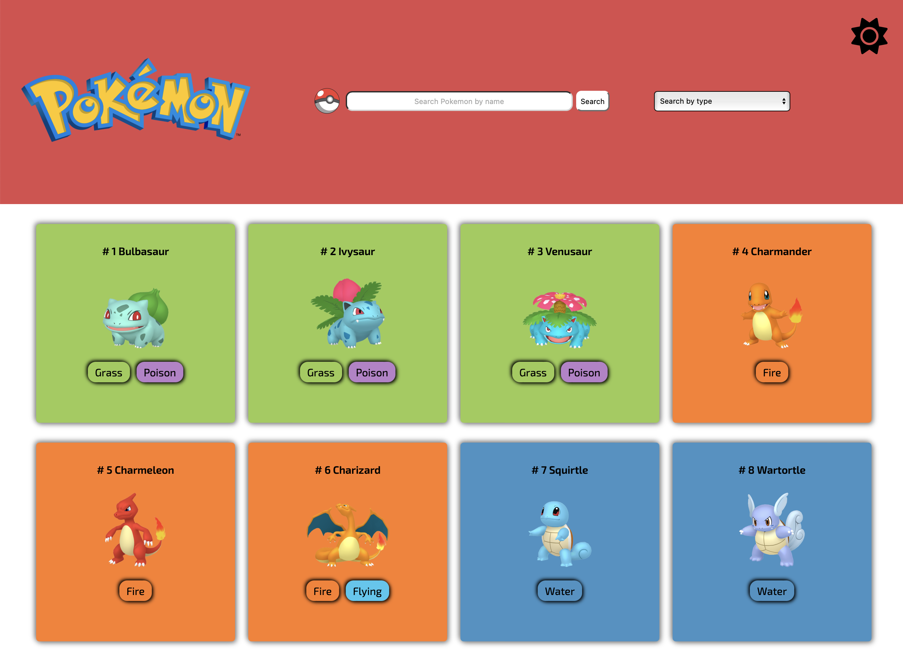
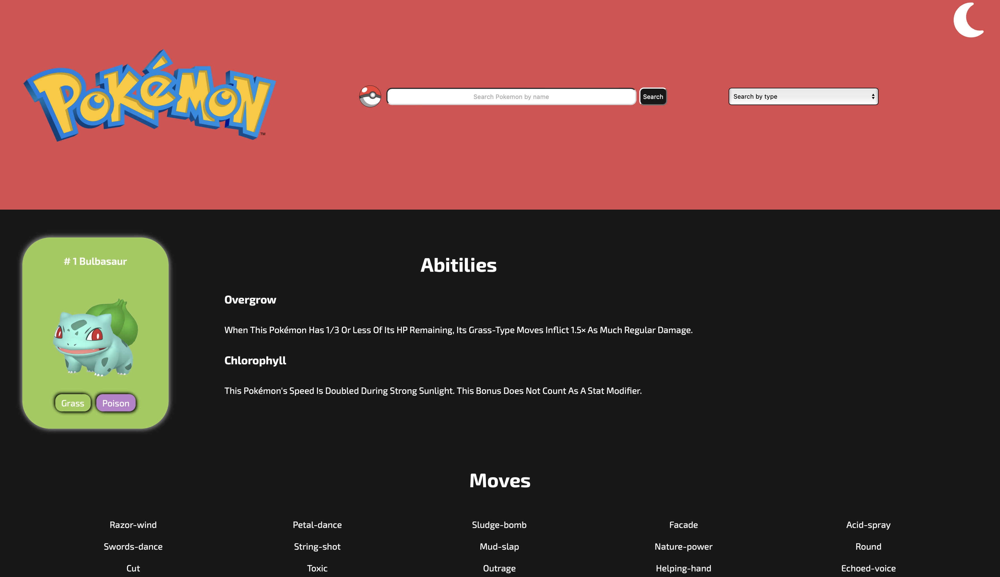

## Pokedex Project

### About the project

This project has the goal to list all pokemons and display their names, numbers and types on the main page and details of a selected pokemon(abilities and moves).
It also has the options to search a pokemon by name or a list of all pokemons by a selected type.
The user can also select between light and dark mode.

API used: [PokeApi](https://pokeapi.co)

### Build with:

<div style="display: inline_block"><br>
  
  
  
      
</div><br>

 **Styled-components** was use to have optimized result.<br>
 The project was build as a **SPA** using **react-router-dom** making easy for the user to navigate thru the pages.


### Installation

* Clone repository:
```
git clone https://github.com/TheodoraNascimento/pokedex.git
```

* Install NPM packges:
```
npm install
```

### Images



